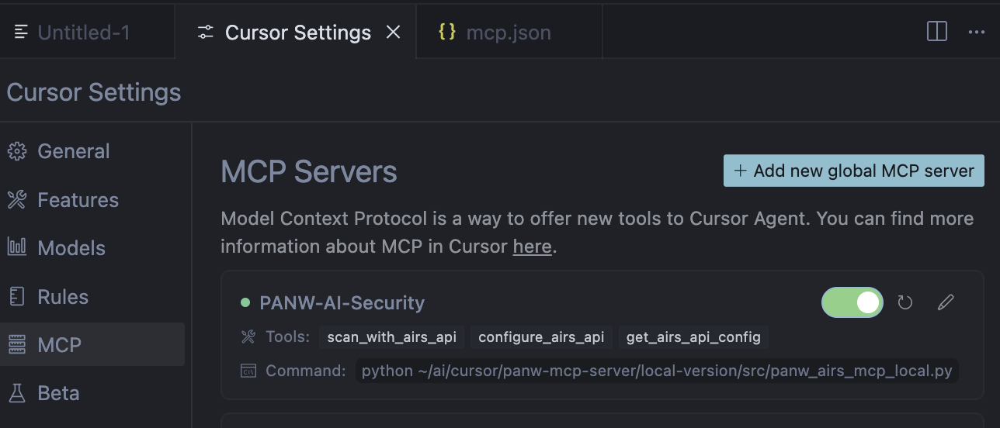
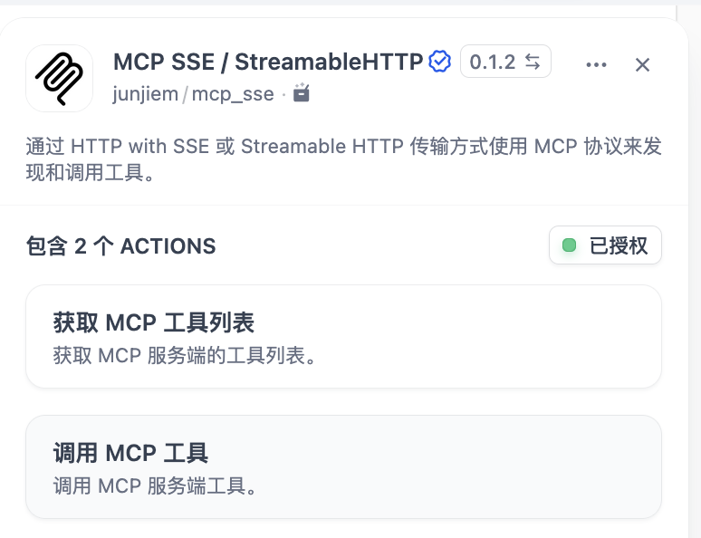
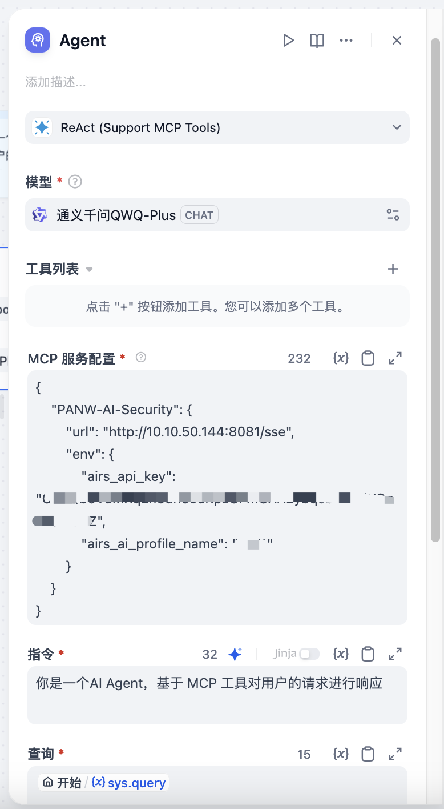
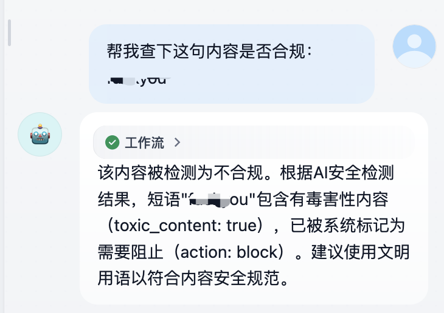

# PANW AI Runtime Security MCP Server

PANW AI Runtime Security MCP server allows you to directly integrate Palo Alto Networks AI security analysis capabilities into any client that supports the [Model Context Protocol (MCP)](https://modelcontextprotocol.io/introduction), such as Claude Desktop, Visual Studio Code, or Cursor IDE.

With this server, you can evaluate content security risks in real-time when using large language models, ensuring safe and compliant AI interactions.

---

## 🚀 Features

- Real-time content risk analysis
- Seamless integration with any MCP-compatible client
- Support for multiple input types (text input, output, code input, code output)
- Content detection based on Palo Alto Networks AI Security API
- Available in local and SSE server versions to accommodate different usage scenarios

---

## IMPORTANT NOTICE BEFORE USE

The software is provided "as is" and the author disclaims all warranties with regard to this software including all implied warranties of merchantability and fitness. in no event shall the author be liable for any special, direct, indirect, or consequential damages or any damages whatsoever resulting from loss of use, data or profits, whether in an action of contract, negligence or other tortious action, arising out of or in connection with the use or performance of this software.


## 💠 Version Information

This project provides two versions for different scenarios:

### Local Version

- Runs as a local MCP service process without requiring an HTTP server
- Suitable for integration with clients that support direct launching of MCP server processes (such as VS Code, Cursor IDE)
- Lightweight, low resource usage, simple configuration

### SSE Version (Server-Sent Events)

- Runs as an HTTP server supporting the SSE protocol
- Can be accessed remotely and supports multiple client connections
- Suitable for deployment as a service or container
- Easy deployment via Docker

---

## 🔑 Prerequisites

Before getting started, you'll need:

1. Palo Alto Networks AI Security API key
2. Configured AI Security profile name

---

## 📋 Installation Guide

### Download Project Files

https://github.com/zm1990s/panw/tree/main/panw-mcp-server

---

## ⚙️ Usage Instructions

### Using the Local Version in Visual Studio Code

1. Install the VS Code MCP plugin
2. Switch to Agent mode, click the configuration button, select `Add More Tool` to add PANW AIRS MCP Server
3. Follow the wizard to set up the launch command, and when complete:

```json
{
    "mcp": {
        "servers": {
            "PANW-AI-Security": {
                "type": "stdio",
                "command": "uv",
                "args": [
                    "run",
                    "src/panw_airs_mcp_local.py"
                ],
                "env": {
                    "AIRS_PROFILENAME": "PROFILENAME",
                    "AIRS_API_KEY": "APIKEY"
                },
            }
        }
    }
}
```

4. After saving the settings, VS Code will automatically start the MCP Server, ensure there are no errors
5. You can now access the `scan_with_airs_api` tool in VS Code


Test screenshot in VS Code:


### Using the Local Version in Cursor IDE

1. Open **Settings** → **MCP** tab
2. Click **"Add new global MCP server"**
3. Paste the following configuration into the `mcp.json` file:

```json
{
    "mcpServers": {
      "PANW-AI-Security": {
        "command": "python",
        "args": [
          "~/ai/cursor/panw-mcp-server/local-version/src/panw_airs_mcp_local.py"
        ],
        "env": {
          "AIRS_API_KEY": "APIKEY",
          "AIRS_PROFILENAME": "PROFILENAME"
        }
      }
    }
  }
```



### Starting the SSE Version Locally

Currently, there are two versions of Python files. If using v2, the key is obtained directly from HTTP requests without setting environment variables. See "Using in Dify 3" for details.

1. Set environment variables

```bash
export AIRS_API_KEY="Your API Key"
export AIRS_PROFILENAME="Your Profile Name"
```

2. Run the server:

```bash
python sse-version/src/panw_airs_mcp_sse.py --host 0.0.0.0 --port 8080
```

3. The server will start on http://localhost:8080
4. Configure your MCP client to connect to this URL

### Starting the SSE Version with Docker

1. Build Docker image:

```bash
cd sse-version
docker build -t panw-airs-mcp-sse .
```

2. Create an environment variable file:

```shell
cat >.env <<EOF
AIRS_PROFILENAME=PROFILENAME
AIRS_API_KEY=KEY
EOF
```

3. Run the container:

```bash
docker run --env-file .env -p 8080:8080 panw-airs-mcp-sse
```

Or use the pre-packaged image:
```bash
docker run --env-file .env -p 8080:8080 dyadin/panw-airs-mcp
```

4. The service will be available at http://YOURIPADD:8080

### Using in Dify 1

In Dify 1.x, you can connect to MCP SSE through plugins:

Example configuration file:

```json
{
    "PANW-AI-Security": {
        "url": "http://10.10.50.144:8080/sse",
        "env": {
            "airs_api_key": "XXXX",
            "airs_ai_profile_name": "XXXX"
        }
    }
}
```



After configuration, ensure the status is "Authorized".

Typically, the SSE service side will have logs like:

```
INFO:     172.17.0.1:55850 - "GET /sse HTTP/1.1" 200 OK
INFO:     172.17.0.1:55864 - "POST /messages/?session_id=58971fab220142dd825004ce292124a9 HTTP/1.1" 202 Accepted
INFO:     172.17.0.1:55864 - "POST /messages/?session_id=58971fab220142dd825004ce292124a9 HTTP/1.1" 202 Accepted
INFO:     172.17.0.1:55864 - "POST /messages/?session_id=58971fab220142dd825004ce292124a9 HTTP/1.1" 202 Accepted
Processing request of type ListToolsRequest
```

Example usage in Agent:


Similarly, the SSE service side will have logs like:

```
INFO:     172.17.0.1:52272 - "POST /messages/?session_id=54cddea100c946859c4c908e2ff3b87f HTTP/1.1" 202 Accepted
Processing request of type CallToolRequest
```

### Using in Dify 2

In Dify 1.x, you can also call it in the workflow Agent:



Example configuration file:

```json
{
    "PANW-AI-Security": {
        "url": "http://10.10.50.144:8080/sse",
        "env": {
            "airs_api_key": "XXXX",
            "airs_ai_profile_name": "XXXX"
        }
    }
}
```

Usage effect:




### Using in Dify 3

If using the v2-url SSE, you can access it through the following method. Environment variables are not needed when starting the SSE service:

```json
{
    "PANW-AI-Security": {
        "url": "http://10.10.50.144:8080/sse?key=CyGQbXXXX&profilename=XXXX"
    }
}
```

If using the v2-header SSE, you can access it through:

```json
{
    "PANW-AI-Security": {
        "url": "http://10.10.50.144:8080/sse",
        "headers": {
            "airs_api_key": "CyGQXXXX",
            "airs_ai_profile_name": "XXXX"
        }
    }
}
```

## 🛠 Tool Functionality

### scan_with_airs_api

This tool calls the Palo Alto Networks AI Security API for content detection.

**Parameters:**
- `inputoroutput`: Input type, can be "input", "output", "codeinput", or "codeoutput"
- `query`: Text content to be checked
- `profileoverride`: (Local version only) Override the default security profile name
- `modelname`: AI model name
- `appname`: Application name
- `appuser`: User identifier

**Returns:**
- The action result from the API and complete JSON response

## 📝 Notes

1. Ensure API key and profile name are correctly set
2. The SSE version listens on 0.0.0.0:8080 by default, which can be modified via parameters
3. When using in production, it's recommended to set up HTTPS and appropriate authentication for the SSE version

---

## 🔄 Troubleshooting

If you encounter issues, check:
1. Whether API key and profile name are correctly set
2. If the network connection is normal
3. If the client is correctly configured for MCP connection